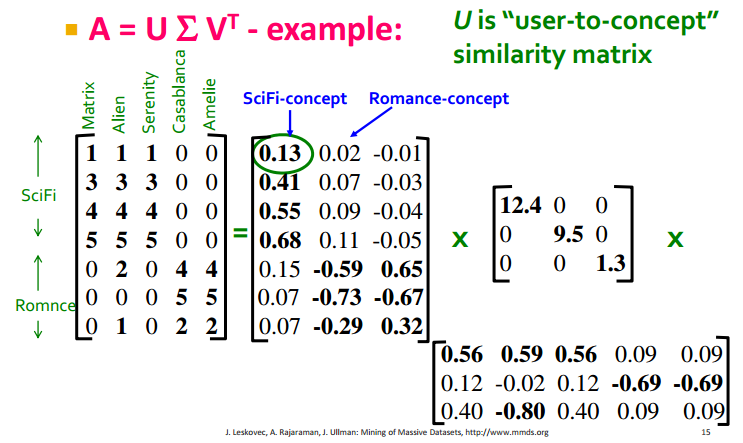
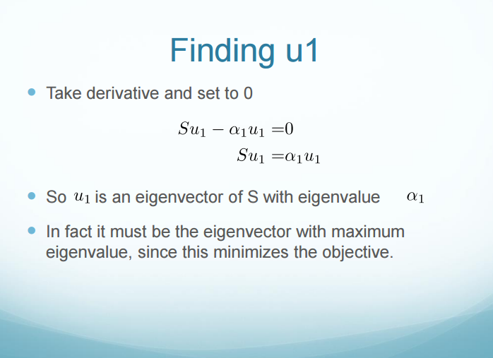
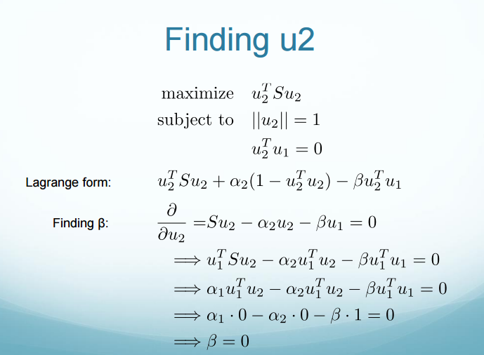

> 在将数据放入模型中训练之前，必然需要经过数据预处理的过程，否则再好的模型也是白搭。本文总结了一些数据预处理的基本流程。

---

## Regularization
1. $$X = \frac{x-min}{max-min}$$, $$X \in [0, 1]$$

2. $$X = \frac{x-\mu}{\sigma}$$ (gaussian distribution)， $$X \in [-1, 1]$$

3. $$X = \frac{2 \times (x-min)}{max-min}-1$$ , $$X \in [-1, 1]$$


---

## Dimensionality Reduction

### Singular Value Decomposition

- Goal: minimize the sum of reconstruction errors

$$ A_[Nxd] \approx U \Sigma V^T = \sum_{i=1}^{r}\sigma_iu_iv_i^T$$

- $$U$$, the left singular matrix, is a $$N \times r$$ unitary matrix(column-orhonormal) such that ```np.dot(u, u.T) = I```
- $$\Sigma$$ is a diagonal $$r \times r$$  matrix with non-negative values where the singular values $$\sigma_i$$ are sorted in descending order
- $$V$$ ,the right singular matrix, is a $$r \times d$$ unitary matrix, such that ```np.dot(v, v.T) = I```


#### Power Method to Compute
  
 - Suppose $$A$$ is square symmetric and has the same right and left singular vectors, namely $$A = \sum_{i=1}^{r}\sigma_iv_iv_i^T$$ then we have 


- Theorem:
  Let $$X = U \Sigma V^T$$ be the SVD of an  $$N \times d$$ matrix X and $$C = \frac{1}{N-1}X^TX$$ be the $$d \times d$$ covariance matrix.
  
  Then, the eigenvectors of C are the same as the right singular vectors of X
  
#### Example


1. 左奇异矩阵表示用户对电影的各项指数的评分（如可以通过比对，大致指出column1表示科幻指数，column2表示浪漫指数，colum3的奇异值较小，可以reduce掉），最后可以用于训练得到一个模型，输入为该电影的分类得到电影可能的打分。
2. 

---

### CUR Decomposition


---

### Principle Component Analysis

- 降维：将$$N \times d$$的矩阵线性转换成$$N \times m$$的矩阵。
- 基本目标：保留好重要的aspect并降维。

#### Maximum variance formulation 

求单位向量$$u_i$$，将$$x_n$$投影到$$u_i^Tx_n$$，使得方差最大。即：

 - mean: $$\overline{x} = \frac{1}{N} \sum_{n=1}^{N}x_n$$ 

- variance: $$\frac{1}{N}\sum_{n=1}^{N}\{ u_i^Tx_n - u_i^T\overline{x} \} = u_i^TSu_i$$ 

- covariance: $$S = \frac{1}{N}\sum_{n=1}^{N}(x_n - \overline{x})(x_n - \overline{x})^T$$

- 限制条件： $$u_i^Tu_i = 1$$

使用Lagrange multiplier求解：
 $$u_i^TSu_i + \lambda (1-u_i^Tu_i)$$
 
 求导即可得到：
 $$Su_i = \lambda_iu_i$$ 
 即 $$u_i^TSu_i = \lambda_i$$ 
 
 即求解eigenvalue即可，同时注意到$$\lambda_i$$越大，variance越大，即越principle。
 
 而此时刚好使用SVD求得$$S$$和$$\Sigma$$！
 
 
 
 
 
 
 计算复杂度：
 
 1. 原计算复杂度：$$O(D^3)$$
 
 2. 使用Power Method：$$O(MD^2)$$
 
 3. 也可以使用EM algorithm计算。

 
 #### Minimum Reconstruction formulation
 
 
 - reconstruct error:
   
   $$minimize = \frac{1}{2N} \sum_{n=1}^{N}\|x_n - \hat{x_n}\|^2$$

where
  
  $$x_n = \sum_{i=1}^D(x_n^Tu_i) u_i$$ 
    
  $$\hat{x_n} = \sum_{i=1}^{M}z_{ni}u_i + \sum_{i=M+1}^{D}b_iu_i$$
    
  
 求解方法基本类似，详见PRML
    
    

---
LASTLY：

PS1: python矩阵运算要用np.dot等那些内置函数啊啊啊啊

PS2: 矩阵的rank和eigenvalue一般没有直接联系